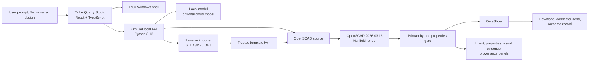

# TinkerQuarry

**Local-first AI CAD for real 3D-printable parts.**

TinkerQuarry turns a plain-English part idea into editable CAD, checks the result against
manufacturing constraints, slices it, and prepares the output for download or printer handoff. It is
private by default: no account, no telemetry, no cloud model unless you explicitly configure one.

[](https://github.com/scottconverse/TinkerQuarry/releases/latest)
[](packages/engine/pyproject.toml)
[](LICENSE)
[](docs/USER-MANUAL.md)
[](docs/STATUS.md)

## The Short Version

TinkerQuarry is for makers and technical users who need functional 3D-printed parts without starting
from a blank CAD file. You describe the part, inspect the generated OpenSCAD, adjust parameters,
review the intent and evidence panels, validate it against a selected printer/material, slice it with
OrcaSlicer, then download or send the current proven output.

Typical parts:

- wall hooks, brackets, clips, spacers, standoffs, trays, holders, simple enclosures, and jigs;
- dimensioned utility parts where exact size matters more than visual ornament;
- repeatable parametric parts that benefit from editable source and trusted CAD twins.

TinkerQuarry is not a certified engineering system. It does not replace human review, professional
CAD for formal drawings, or safety-critical design validation.

## What Is In TinkerQuarry

The current release is **TinkerQuarry v1.5.1** with **KimCad engine 0.9.4**. It supersedes v1.4.0;
v1.5.0 was published, failed its gate, and remains withdrawn to pre-release (see
[docs/STATUS.md](docs/STATUS.md)). The package versions intentionally differ because the desktop
product, internal engine, share web surface, and shared helpers are separately versioned surfaces.

Implemented and documented:

- Prompt-to-CAD generation through the local KimCad engine.
- OpenSCAD source view, editor, formatter, viewer, customizer parameters, save/reopen, and export.
- Intent panel with parsed design plan, assumptions, dimensions, and feature list.
- Properties panel with estimated volume, material, mass, center of mass, surface area, bed contact,
  and bounding box.
- Labeled multi-view visual inspection cards for correction/evidence review.
- Plain-English agent toolbox and provenance disclosure.
- Printability/readiness gate with stale-state blocking.
- Manual orientation, slice, download, connector send, and outcome recording.
- Reverse import from STL/3MF/OBJ into known trusted part families when measurements match.
- CadQuery trusted twins for the editable CAD/STEP precision lane where available.
- Optional cloud model configuration, off by default.
- Windows NSIS installer and native runtime smoke coverage.
- Share web surface for public/shared output experiments, deployed separately from the desktop app.

See the full [User Manual](docs/USER-MANUAL.md), [Architecture](docs/ARCHITECTURE.md), and
[Status Matrix](docs/STATUS.md) for the detailed truth table.

## Install

The supported beta platform is Windows.

1. Download the `_x64-setup.exe` installer from the
   [latest GitHub Release](https://github.com/scottconverse/TinkerQuarry/releases/latest).

   > **Not v1.5.0** — it was published, then failed review and was moved back to pre-release.
   > The link above always resolves to whatever is current.
2. Double-click the installer. The current release (v1.5.1) is an unsigned beta, so SmartScreen
   will warn — choose **More info**, then **Run anyway**. Code signing (Azure Trusted Signing,
   verified publisher Scott Converse) was introduced in v1.5.0; that build was withdrawn, and
   signing returns to the shipped line in a later build.
3. Launch **TinkerQuarry**.
4. Confirm printer/material settings.
5. Build a small first part, such as `a 70 mm round coaster, 4 mm tall`.

Only install from the official GitHub Release, and verify the checksum against the release's
`SHA256SUMS.txt` when provenance matters
(`Get-FileHash .\<the-installer-you-downloaded>.exe -Algorithm SHA256`). The
[User Manual](docs/USER-MANUAL.md) covers verification step by step.

## First Workflow

1. **Describe** the part with plain language and real dimensions.
2. **Inspect** the generated model in the Studio viewer and source editor.
3. **Read the intent** to confirm the plan, assumptions, dimensions, and features match what you
   asked for.
4. **Adjust parameters** instead of regenerating whenever a deterministic slider is available.
5. **Check properties and evidence** before manufacturing.
6. **Make it real** by selecting printer/material, orienting, validating, and slicing.
7. **Download or send** only after the app has a current successful slice.

## Developer Quick Start

Requirements:

- Windows for the full native installer/release path.
- Node.js with Corepack and pnpm `10.12.4`.
- Python `3.13`.
- Rust/MSVC build tools for Tauri.

Fresh checkout:

```powershell
cd path\to\TinkerQuarry
corepack enable
pnpm install
cd packages\engine
py -3.13 -m venv .venv
.\.venv\Scripts\python.exe -m pip install -r requirements.lock
.\.venv\Scripts\python.exe -m pip install -e .
.\.venv\Scripts\python.exe -m pip install -e ".[dev]"
```

Run the local engine and UI:

```powershell
# Terminal 1
cd path\to\TinkerQuarry\packages\engine
$env:TINKERQUARRY_DEV_TOKEN = "tq-dev-token"
.\.venv\Scripts\kimcad.exe web --port 8765
```

```powershell
# Terminal 2
cd path\to\TinkerQuarry\apps\ui
pnpm dev
```

Open `http://localhost:1420`.

## Verification And Release Proof

Primary gate:

```powershell
pnpm test:gate
```

Full native release gate:

```powershell
pnpm test:release
```

Current clean evidence:

- `pnpm test:gate` passed with UI Jest, web Jest, Rust/Tauri tests, Rust audit, web share deploy
  dry-run, engine pytest, and Playwright browser coverage.
- Native Windows release build produced an NSIS installer.
- Release executable smoke passed.
- Installed NSIS smoke passed after installing into an isolated test location.
- The intentionally malformed reverse-import mesh test passes by rejecting the bad mesh. That is the
  intended behavior.

Important native-build note: Windows NSIS packaging can fail from very deep workspace paths because
of path-length limits in bundled slicer/profile assets. The verified workaround is to build from a
short path such as `C:\tqbuild\TinkerQuarry`.

The evidence-backed status matrix is [docs/STATUS.md](docs/STATUS.md). The current release is
v1.5.1 — see the
[releases page](https://github.com/scottconverse/TinkerQuarry/releases/latest) (v1.5.0 is published
but withdrawn to pre-release).

## Architecture At A Glance



The desktop app is a Tauri shell around a React/TypeScript Studio UI. The UI talks to a local Python
engine. The engine uses OpenSCAD for geometry, PrintProof3D and mesh checks for readiness,
OrcaSlicer for G-code, and optional CadQuery trusted twins for precise STEP export. All manufacturing
actions are blocked when source, render, printer/material, orientation, or slice state becomes stale.

Full architecture: [docs/ARCHITECTURE.md](docs/ARCHITECTURE.md).

## Repository Map

```text
apps/ui/           Production TinkerQuarry Studio UI and Tauri desktop shell
apps/web/          Optional public/share web surface
packages/engine/   KimCad engine, HTTP API, tools, config, printer profiles
packages/shared/   Shared TypeScript helpers
docs/              Product docs, landing page, manual, architecture, status, discussions
scripts/           Native release, smoke, and test helpers (incl. the license gate)
```

## Documentation

- [User Manual](docs/USER-MANUAL.md)
- [Architecture](docs/ARCHITECTURE.md)
- [Status Matrix](docs/STATUS.md)
- [Changelog](CHANGELOG.md)
- [Discussion Seeds](docs/discussions/README.md)
- [Third-Party Licenses](packages/engine/THIRD_PARTY_LICENSES.md)

Project governance (why, what, how, when):

- [Project Charter](docs/governance/PROJECT-CHARTER.md) — goals, scope, constraints, risks
- [Product Requirements](docs/governance/PRD.md) — features by Verified/Implemented/Planned
- [Software Architecture Document](docs/governance/SAD.md) — decision records, license and trust boundaries
- [Roadmap](docs/governance/ROADMAP.md) — v1.5 → v1.6 → v2.0 with exit proofs
- [CAD Agent Roadmap](docs/roadmap-zookeeper-inspired-cad-agent.md) — longer-horizon agent concept

## Share Web Deployment

The optional share surface in `apps/web` deploys separately to Cloudflare Pages. It uses:

- `SHARE_KV` for share metadata;
- `SHARE_R2` for thumbnails;
- `SHARE_RATE_LIMITER`, a Durable Object worker named `tinkerquarry-share-rate-limiter`.

Verify the packaging path with:

```powershell
pnpm test:web:share-deploy
```

## License

TinkerQuarry is GPL-2.0-only. See [LICENSE](LICENSE).

Bundled third-party SCAD libraries are selected for GPL-2.0 compatibility. Dan Kirshner
`threads.scad` is intentionally excluded because the available source is GPL-3.0-or-later; thread
support is provided by a first-party wrapper over vendored BOSL2.
