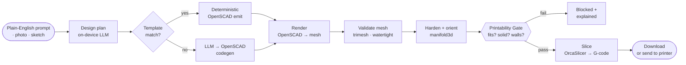

<p align="center">
  
</p>

<p align="center">
  <a href="LICENSE"></a>
  
  
  
  
</p>

<h1 align="center">TinkerQuarry</h1>

<p align="center"><b>Describe a 3D-printable part in plain English — or a photo, or a sketch — and get a checked, print-ready file. On your own machine. No CAD skills, no account, no cloud.</b></p>

---

TinkerQuarry is a local-first, AI-native desktop app for making real, printable things. You type
what you want; it plans the shape with an on-device language model, builds the geometry with a
deterministic CAD engine, **checks that it's actually printable against your printer**, slices it
to G-code, and can send it to your machine — start to finish, nothing leaving your computer unless
you choose.

It is built on two proven pieces: the **KimCad** manufacturing engine (the brain) and a
reskinned, maker-first interface (the face). See [Naming](#naming-tinkerquarry-vs-kimcad) for why
you'll see `kimcad` in the plumbing.

## What it looks like

> A real run on a laptop-class machine (no discrete GPU), start to finish:

```
$ tinkerquarry design "a desk cable clip for an 8 mm cable" --slice

  Planning the shape…        (qwen2.5:7b, on-device)
  Rendering the part…        (OpenSCAD)
  Checking it for printing…  (printability gate)

cable_clip — A desk cable clip designed to hold an 8 mm cable.
Printer: Bambu Lab P2S   Material: PLA
Gate: PASS
  Size: 16.0 × 27.0 × 10.0 mm   Mesh: watertight, 1 body, 3761 mm³
  Orientation: rests on most stable facet   Hardening: manifold3d (genus 1)
  Readiness: 92/100 — Ready to print
Slice: 17,034 G-code lines → part.gcode.3mf   ~6m58s · 50 layers · 1.93 cm³
```

That whole chain — words → print-ready G-code — runs **on your machine**.

## Why it's different

- **Plain words in, printable file out.** No sketches, constraints, or extrusions to learn.
- **It checks before it prints.** Every part is validated against *your* printer's build volume and
  capabilities by a **printability gate** — a part that won't print is blocked, not handed to you to
  discover at the nozzle.
- **Genuinely local.** The AI runs on-device (Ollama). No account, no cloud by default; nothing you
  make leaves your computer unless you turn on an optional cloud model.
- **It manages its own engine.** First run sets up the local AI for you — no "go install Ollama
  yourself." Kill the AI mid-design and it self-heals.
- **Real manufacturing, not just a mesh.** Mesh validation, 2-manifold hardening, auto-orientation,
  slicing with real printer profiles, and direct send (OctoPrint / Bambu LAN / Moonraker / PrusaLink).

## How it works



The gate is the heart of it: **slicing and sending are refused unless the part passes**, and a part
is re-checked from its actual mesh whenever it's reopened or imported. See the
[Architecture chapter](docs/MANUAL.md#part-iii--architecture) for the full picture, the
cross-language seam, and the security model.

## Quickstart

> **Requires** a one-time local toolchain: Python 3.13, OpenSCAD, OrcaSlicer, and Ollama (for the
> on-device AI). The first-run wizard sets up the AI for you. Full steps:
> [Manual → Install & first run](docs/MANUAL.md#1-install--first-run).

```bash
# Launch the app (full functional UI on the real engine):
kimcad web                       # → http://127.0.0.1:8765

# …or go straight to a print-ready file, headless:
kimcad design "a 90 mm round trinket dish" --slice
```

Just exploring the interface with no toolchain? The repo ships an **offline dev mode** (a
dependency-free mock of the engine API) so the front-end runs anywhere:

```bash
python scripts/dev.py            # workspace :8753 + mock API :8766
```

## Project status

**GauntletGate verdict: ✅ CLEAR TO ADVANCE** (0 Blocker / 0 Critical; a new user reaches the core
feature). The full pipeline is proven end-to-end on real hardware; **405** front-end + **1,590**
engine + **19** glue tests pass (0 failing). The one step deliberately left for the operator is sending to a
**physical printer**. Evidence: [gate report](gate-tinkerquarry-2026-06-21/gate-report.md) ·
honest build state: [docs/STATUS.md](docs/STATUS.md).

## Documentation

| Doc | For |
|---|---|
| **[Manual](docs/MANUAL.md)** | Everything — non-technical guide, technical reference, and architecture (with diagrams) |
| [STATUS.md](docs/STATUS.md) | Exactly what runs today, with evidence |
| [PRD](docs/TinkerQuarry-PRD-v0.3.md) | Product requirements |
| [API contract](../KimCadClaude/docs/api.md) | The engine's local HTTP API |
| [Discussions](docs/discussions/) | Announcement, FAQ, Show & Tell, roadmap seeds |

## Naming: TinkerQuarry vs `kimcad`

**TinkerQuarry is the product; KimCad is the engine inside it.** The KimCad manufacturing engine is
the host, and its front-end was reskinned to TinkerQuarry. You'll see TinkerQuarry in the UI but
`kimcad` in the plumbing — the CLI (`kimcad web`, `kimcad design`), the `.kimcad` design-file
format, and the `X-KimCad-Session` security header. **Those identifiers are intentionally kept** —
renaming protocol/format strings would break the API contract and saved files. If `kimcad.exe`
serves a "TinkerQuarry" window, that's expected.

## License

**GPL-2.0** — see [LICENSE](LICENSE). TinkerQuarry combines GPL-2.0 components (the OpenSCAD-derived
front-end runtime; the engine invokes OpenSCAD), which sets the combined work's license. Bundled
permissive libraries keep their own licenses; an in-app About/Licenses surface is planned. The exact
copyleft reconciliation across the engine and the bundled binaries is being finalized — see the gate
report's licensing note.

## Contributing

TinkerQuarry is in active development. Start a thread in
[Discussions](docs/discussions/), file focused issues with repro steps, and run the test suites
before a PR (`npm test` in `KimCadClaude/frontend`, `pytest` in `KimCadClaude`, and the glue tests
in `backend/tests`). The bar is the [GauntletGate](gate-tinkerquarry-2026-06-21/gate-report.md):
first-run reachable, safety invariants intact, 0 Blocker / 0 Critical.
