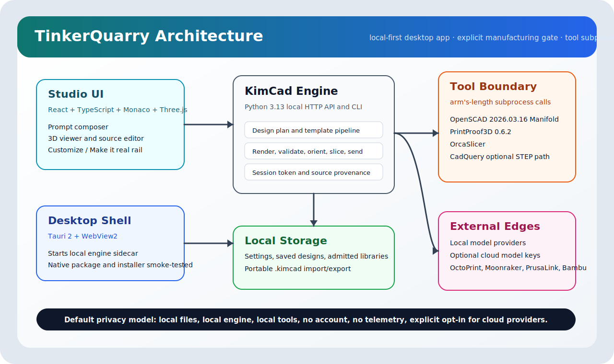
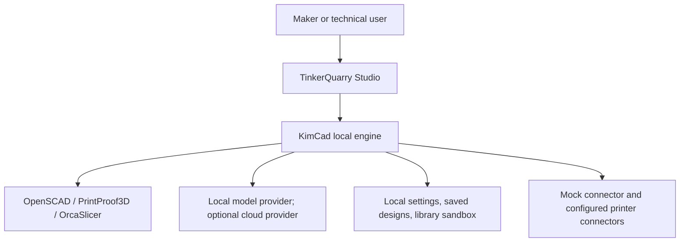
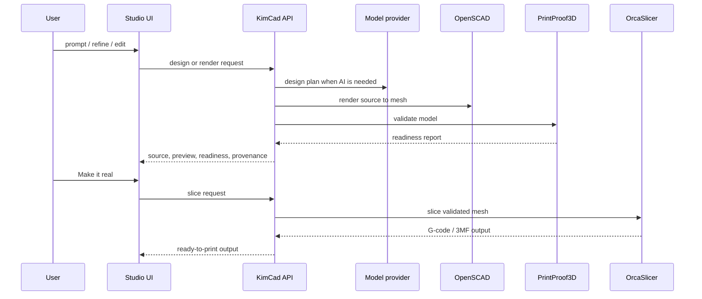

# TinkerQuarry Architecture And Technologies

**Release:** v1.3.1 beta
**Status:** release-gated Windows beta

This document describes the production architecture, key technologies, trust boundaries, and release
proof for TinkerQuarry.



## 1. Architectural Goals

TinkerQuarry is designed around five constraints:

1. **Local-first privacy.** No account and no cloud by default.
2. **Manufacturing truth.** A model is not ready until source, geometry, validation, slice, and send
   state agree.
3. **Arm's-length tooling.** OpenSCAD, OrcaSlicer, and PrintProof3D run as subprocess tools with
   explicit pins and boundaries.
4. **Transparent provenance.** Generated source, validation state, slice state, and iteration history
   are visible to the user.
5. **Fail-closed behavior.** Stale or failed state blocks manufacturing actions.

## 2. System Context



## 3. Runtime Layers

| Layer        | Location                               | Technology                          | Responsibility                                                    |
| ------------ | -------------------------------------- | ----------------------------------- | ----------------------------------------------------------------- |
| Native shell | `apps/ui/src-tauri`                    | Tauri 2, Rust, WebView2             | desktop app, sidecar launch, native packaging                     |
| Studio UI    | `apps/ui/src`                          | React, TypeScript, Monaco, Three.js | prompt, code, viewer, controls, dialogs, workflow state           |
| Local API    | `packages/engine/src/kimcad/webapp.py` | Python 3.13                         | local HTTP API, session token, state orchestration                |
| Pipeline     | `packages/engine/src/kimcad`           | Python                              | prompt planning, source generation, render, validate, slice, send |
| Geometry     | bundled tool                           | OpenSCAD 2026.03.16                 | SCAD to mesh/3MF/STL, Manifold backend by default                 |
| Validation   | bundled tool                           | PrintProof3D 0.6.2                  | mesh/readiness report                                             |
| Slicing      | bundled tool                           | OrcaSlicer                          | G-code generation from validated mesh                             |
| Models       | local or configured                    | OpenAI-compatible providers         | design planning and advisory VCL probes                           |

## 4. Data Flow



## 5. Trust Boundaries

| Boundary                   | Risk                                   | Control                                                          |
| -------------------------- | -------------------------------------- | ---------------------------------------------------------------- |
| UI -> local engine         | unintended remote use                  | loopback default, session token, explicit dev token in local dev |
| Engine -> subprocess tools | environment/secret leakage             | scrubbed subprocess environment for tool calls                   |
| SCAD source includes       | path traversal or unsafe local leakage | sanitizer and admitted library sandbox                           |
| Optional cloud models      | prompt disclosure                      | user-configured provider/key only                                |
| Printer connectors         | physical action                        | explicit send confirmation and connector configuration           |
| Saved design import        | stale or untrusted source              | re-render and re-gate before manufacturing                       |

## 6. Manufacturing Gate

TinkerQuarry separates readiness levels:

- **Ready to slice** means the rendered model passed design/mesh checks.
- **Ready to print** means a current slice exists for the selected printer/material/orientation.

Any source edit, parameter change, printer/material change, or manual orientation change invalidates
stale manufacturing output.

## 7. Visual Correction Loop

The Visual Correction Loop is an advisory loop:

- captures viewer images;
- asks local vision-capable probe models atomic yes/no questions;
- records provenance in the iteration log;
- can run bounded correction/refine rounds;
- never replaces deterministic geometry validation or slicing.

The current beta bar is local probe accuracy, not measurement-grade vision.

## 8. Packaging

The Windows package is built by Tauri and includes the staged KimCad engine/tooling needed by the
desktop app. Release proof for v1.3.1 includes:

- native build;
- MSI/NSIS artifact production;
- release executable smoke;
- installed NSIS workflow smoke with isolated profile.

## 9. Technology Inventory

| Technology          | Use                                             |
| ------------------- | ----------------------------------------------- |
| React               | workspace UI                                    |
| TypeScript          | front-end type safety                           |
| Monaco              | OpenSCAD source editor                          |
| Three.js            | 3D preview and visual capture                   |
| Tauri 2             | native desktop shell                            |
| Rust                | Tauri command layer                             |
| Python 3.13         | KimCad engine                                   |
| OpenSCAD 2026.03.16 | geometry kernel                                 |
| PrintProof3D 0.6.2  | printability validation                         |
| OrcaSlicer          | slicing                                         |
| Playwright          | browser e2e release proof                       |
| Jest                | UI/web unit tests                               |
| pytest              | engine test suite                               |
| GitHub Actions      | CI and manual self-hosted release gate workflow |

## 10. Release Proof

The release command:

```powershell
pnpm test:release
```

v1.3.1 was tagged and published from commit `4e159c2a189e4b388204baf636acd46ac430a1c0`
after the release command, installed-app smoke, and GauntletGate pass were clean.

See:

- [Status Matrix](STATUS.md)
- [GitHub Release](https://github.com/scottconverse/TinkerQuarry/releases/tag/v1.3.1)
- [Evaluation Guide](EVALUATE.md)

## 11. Share Web Deployment

The share web surface is optional and separate from the local desktop workflow. It deploys as a
Cloudflare Pages app with:

| Binding              | Purpose                                               |
| -------------------- | ----------------------------------------------------- |
| `SHARE_KV`           | Stores compressed share metadata                      |
| `SHARE_R2`           | Stores generated share thumbnails                     |
| `SHARE_RATE_LIMITER` | Durable Object binding for atomic per-IP share limits |

The Durable Object lives in `apps/web/rate-limiter-worker` and is deployed as
`tinkerquarry-share-rate-limiter`. Pages binds to it by `script_name` in `apps/web/wrangler.toml`.
Deploy order:

1. `pnpm --filter web share:rate-limiter:deploy`
2. Deploy the Cloudflare Pages project from `apps/web/dist`

For local verification, `pnpm test:web:share-deploy` runs the web share build, the Pages Functions
compile, and a dry-run deployment of the Durable Object worker.
