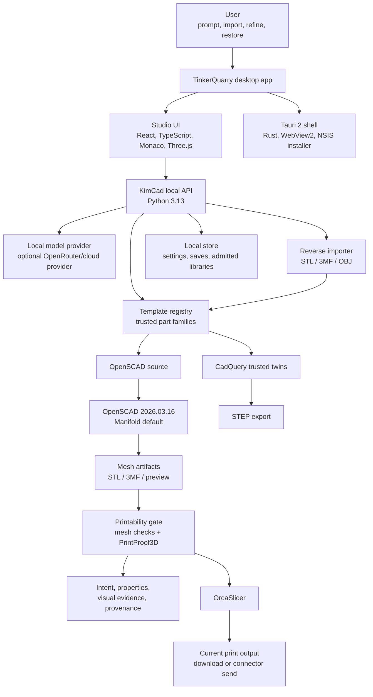
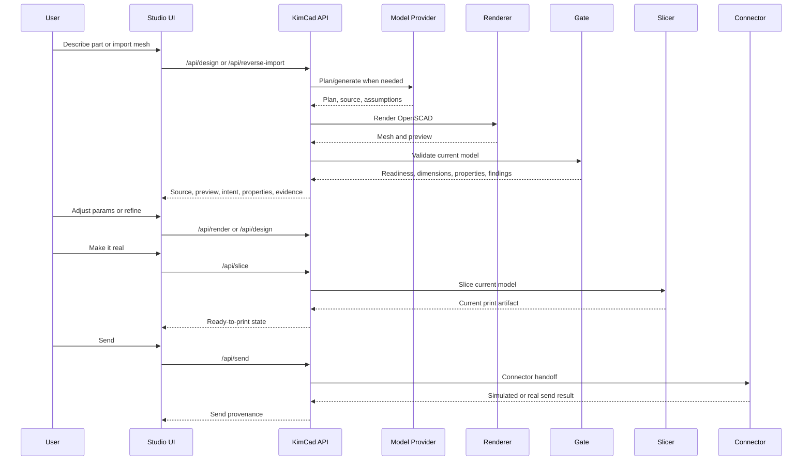
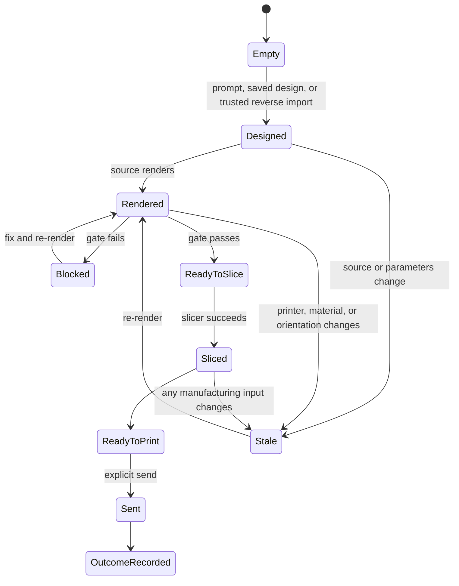
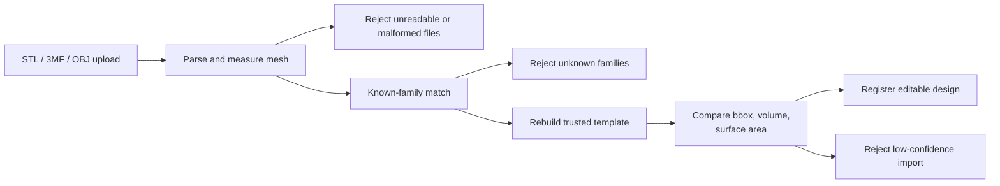
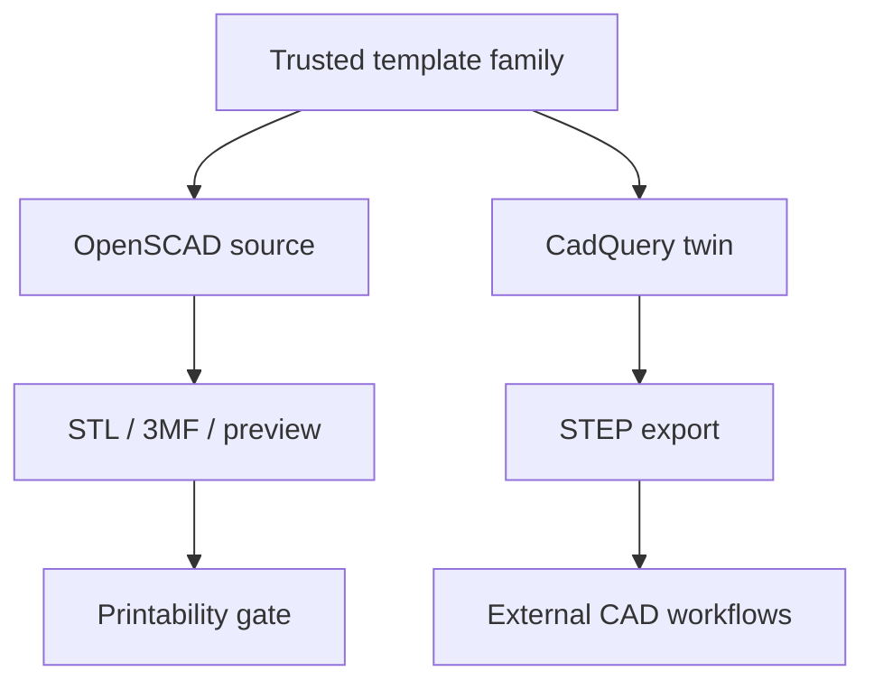

# TinkerQuarry Architecture

**Product:** TinkerQuarry v1.5.0 Windows beta
**Engine:** KimCad 0.9.4
**Last updated:** 2026-07-18

TinkerQuarry is a desktop-first, local-first AI CAD system for functional 3D-printed parts. The
architecture is built around a plain rule: AI can help plan and generate, but deterministic state
controls whether an output can be manufactured.

## Design Goals

1. **Local-first privacy:** no account, telemetry, or cloud model by default.
2. **Source-visible CAD:** generated geometry is editable OpenSCAD, not a hidden blob.
3. **Manufacturing truth:** ready-to-print requires a current successful slice, not just a pretty
   preview.
4. **Evidence over magic:** intent, assumptions, properties, visual inspection cards, and provenance
   are visible.
5. **Fail-closed state:** stale source, stale slices, failed gates, and unsafe imports block
   manufacturing actions.
6. **Trusted precision lane:** known templates can have CadQuery twins for STEP export.

## System Diagram

## Runtime Layers

| Layer | Location | Technology | Responsibility |
| --- | --- | --- | --- |
| Native shell | `apps/ui/src-tauri` | Tauri 2, Rust, WebView2 | Native app, installer metadata, shell integration, packaged runtime |
| Studio UI | `apps/ui/src` | React, TypeScript, Monaco, Three.js | Prompting, editor, viewer, customizer, panels, workflow state |
| Local API | `packages/engine/src/kimcad/webapp.py` | Python 3.13 | Loopback API, session token, settings, design and manufacturing orchestration |
| Pipeline | `packages/engine/src/kimcad` | Python | Design planning, template selection, rendering, validation, slicing, send |
| Geometry | bundled tool | OpenSCAD 2026.03.16 | OpenSCAD-to-mesh rendering, Manifold backend by default |
| Validation | bundled/local tools | Mesh checks, PrintProof3D 0.6.2 | Readiness report, dimensions, printability findings |
| Slicing | bundled tool | OrcaSlicer | Printer/material-specific G-code/3MF output |
| CAD precision | optional engine lane | CadQuery trusted twins | STEP export for supported template families |
| Share web | `apps/web` | Vite, Cloudflare Pages | Optional public/share workflow outside private desktop core |

## Design And Manufacturing Flow

## State Model

The state machine is enforced on both client and server. A UI button being enabled is not the only
guard. The API also refuses unsafe manufacturing requests.

## Evidence Surfaces

TinkerQuarry exposes evidence as first-class UI, not as hidden logs:

- **Intent panel:** parsed plan, assumptions, target dimensions, and requested features.
- **Properties panel:** volume, material estimate, mass, center of mass, surface area, build-plate
  contact, and bounding box.
- **Visual inspection cards:** labeled multi-view evidence and before/after correction details.
- **Provenance disclosure:** plain-English account of model/tool involvement.
- **Iteration log:** design, refine, correction, restore, branch, slice, send, and outcome history.

## Reverse Import Architecture

Reverse import is conservative by design. It does not try to infer arbitrary CAD from arbitrary
meshes. It recovers editable intent only when the mesh clearly belongs to a trusted family.

## CadQuery / STEP Precision Lane

The precision lane gives supported template families a clearer editable CAD/STEP path without making
every generated mesh pretend to be parametric CAD. STEP export is available only when a trusted twin
and CadQuery runtime are available.

## Trust Boundaries

| Boundary | Risk | Control |
| --- | --- | --- |
| UI to engine | unwanted state-changing requests | loopback default and per-boot session token |
| Engine to subprocess tools | secret leakage or path leakage | scrubbed subprocess environment and path redaction |
| SCAD includes | local file disclosure or unsafe include paths | admitted library sandbox and include sanitizer |
| Cloud models | prompt disclosure | off by default, explicit provider/key configuration |
| Printer connectors | physical machine action | explicit send confirmation and connector setup |
| Reverse import | unsafe/untrusted geometry | known-family matching and fail-closed rejection |

## Model Context Protocol (MCP) Interface

The desktop app includes an optional MCP server for integration with external AI agents. The
server is **disabled by default** and runs on `127.0.0.1:32123` (loopback only) when enabled.

**Exposed capabilities:**
Seven tools allow callers to manage workspaces, inspect project state, trigger renders, capture
previews, and export designs. These capabilities include file-write access to arbitrary desktop
paths via the `export_file` tool.

**Security model (partially landed — do not read this as finished):**

The listener binds `127.0.0.1` only and is disabled by default. Three controls are in the tree,
at three different levels of done:

- *Origin validation* — landed and tested. Implemented with `rmcp`'s own `with_allowed_origins`
  rather than a CORS layer: `rmcp` performs RFC 6454 matching internally and emits no CORS
  response headers. This distinction is load-bearing. The reason a hostile page cannot currently
  reach the tools is that its preflight is *refused*; adding a `tower_http` `CorsLayer` — the
  obvious way to "add origin allow-listing" — would make the server answer preflights and open
  the exact drive-by it was meant to close. A regression test asserts the preflight returns no
  `Access-Control-Allow-Origin`; do not replace it with a CORS layer.
- *Per-boot bearer token* — enforced server-side, but not surfaced by the frontend, so no
  external client can currently authenticate. The feature is effectively inert until the UI
  exposes the token.
- *`export_file` path confinement* — implemented and known to be incomplete. Review found inputs
  that escape the workspace root, including paths that climb above their own anchor. The guard
  fails open on those, so it must be treated as unfinished.

The genuine exposure is local, non-browser callers: origin checks do nothing against a script
that simply omits the header, which is why the token is the control that matters here.

## Packaging

The Windows desktop app is packaged by Tauri as an NSIS installer. The package stages the KimCad
engine and local tools required by the desktop flow.

Current packaging evidence:

- NSIS target is explicit in `apps/ui/src-tauri/tauri.conf.json`.
- `scripts\native-release.cmd` runs the UI Tauri build from the app workspace.
- The installer build passed from a short Windows path to avoid NSIS path-length failures.
- Direct Tauri runtime smoke passed.
- Installed NSIS smoke passed with an isolated profile.

## Share Web Surface

The share web app is not the private desktop workflow. It is a separate deployable surface in
`apps/web` for public/shared outputs. It uses Cloudflare Pages, KV, R2, and a Durable Object rate
limiter. Its packaging path is verified by `pnpm test:web:share-deploy`.

## Naming

- **TinkerQuarry** is the public product, app, installer, docs, and repo.
- **KimCad** is the internal Python engine and CLI.
- **OpenSCAD Studio** is the upstream UI lineage. It is attribution/history, not current product
  identity.

## Roadmap Architecture

Near-term architecture extensions:

- expand known-family reverse import coverage;
- add STEP/STP reverse-to-parametric import after trusted mesh-family matching matures;
- certify real hardware connector behavior by printer family;
- package additional platforms after Windows beta stabilizes.
