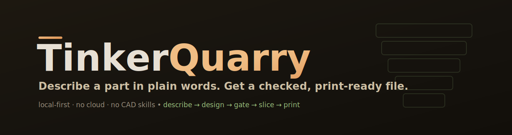
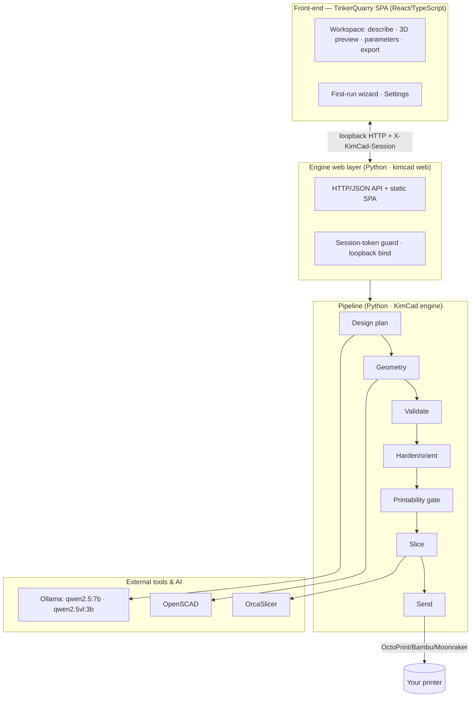
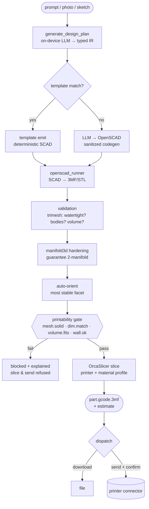
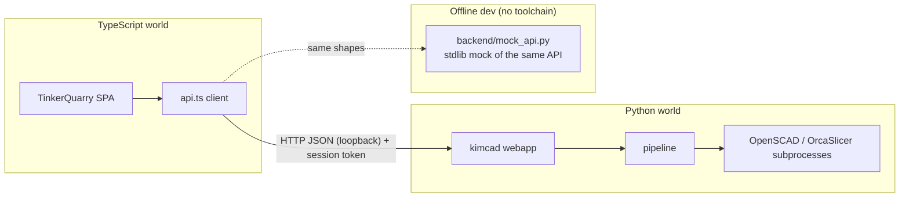
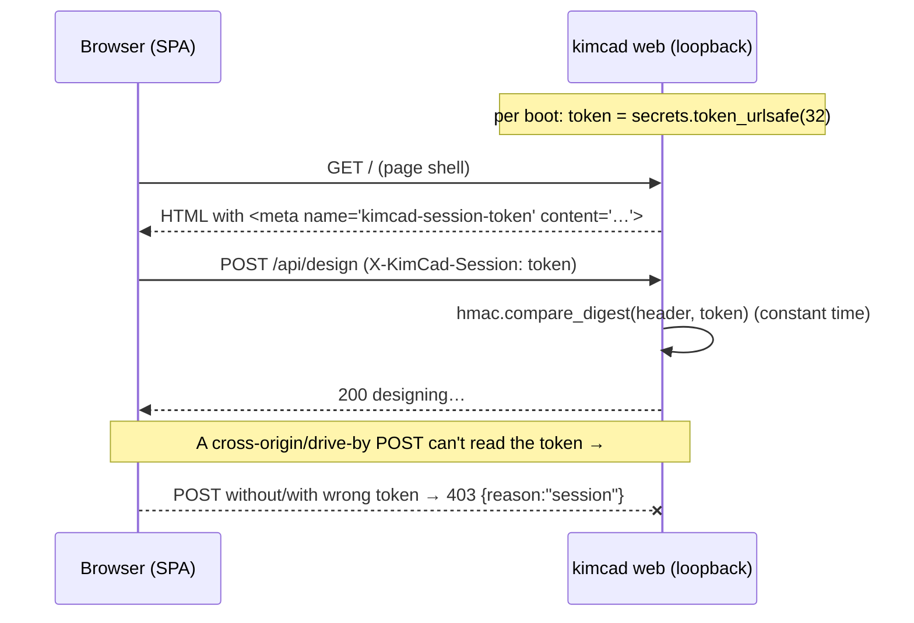

<p align="center">
  
</p>

# TinkerQuarry — Manual

> ⚠️ **This manual describes the TARGET product (per the PRD), not the current build.** Several features
> it covers — the Visual Correction Loop, the code drawer, the rich viewer, library management — are
> **not yet implemented.** For what actually works today, see the canonical [STATUS matrix](STATUS.md)
> and the [recovery plan](TinkerQuarry-Recovery-Plan-v2.md).

This manual has three parts. Read the one that fits you:

- **[Part I — Using TinkerQuarry](#part-i--using-tinkerquarry)** — for everyone. No technical
  background needed.
- **[Part II — Technical reference](#part-ii--technical-reference)** — the CLI, API, config,
  connectors, formats, and tests.
- **[Part III — Architecture](#part-iii--architecture)** — how it's built, with diagrams.

> **One naming note up front:** the product is **TinkerQuarry**; the engine inside it is **KimCad**.
> The app window says TinkerQuarry; the command line and files say `kimcad`. That's intentional —
> see the [README](../README.md#naming-tinkerquarry-vs-kimcad).

---

# Part I — Using TinkerQuarry

## What it is

TinkerQuarry turns a plain-English description into a 3D-printable file. You describe a part — *"a
desk cable clip for an 8 mm cable"* — and it designs the shape, checks that it will actually print
on your printer, and gives you a ready-to-print file. You can also start from a **photo** or a
**sketch**.

Everything runs on your own computer. There's no account, and by default nothing you make leaves
your machine.

**Who it's for:** makers, tinkerers, and anyone with a 3D printer who wants functional parts without
learning CAD. You don't draw anything. You describe it.

## 1. Install & first run

TinkerQuarry needs a few tools on your machine. On Windows, the installer/setup brings them
together; the pieces are:

| Tool | What it's for | Roughly |
|---|---|---|
| **Python 3.13** | runs the engine | ~30 MB |
| **OpenSCAD** | builds the geometry | ~25 MB |
| **OrcaSlicer** | turns the part into printer instructions (G-code) | ~160 MB |
| **Ollama + a model** | the on-device AI that reads your words | ~5 GB (downloaded once) |

**The first time you open TinkerQuarry, a setup wizard walks you through it:**

1. **Welcome** — what the app does.
2. **Set up your AI** — one click. TinkerQuarry downloads and starts the local AI for you; you don't
   install anything by hand. (Already have a local AI engine? It reuses it.)
3. **Pick your printer** — sets the build volume and quality checks so parts are validated against
   *your* machine.
4. **Direct printing** *(optional)* — connect a printer to send jobs straight from the app, or skip
   and just download files.
5. **Ready** — you're in.

You can reopen this setup any time from **Settings**. Most first prints are ready in under 15 minutes.

## 2. The core flow: describe → preview → check → print

```
   ┌──────────┐     ┌──────────────┐     ┌───────────────┐     ┌──────────────────┐
   │ 1. Describe│ ──▶ │ 2. Preview &  │ ──▶ │ 3. Check &     │ ──▶ │  Download or send │
   │  (or photo)│     │    refine     │     │    download    │     │   to your printer │
   └──────────┘     └──────────────┘     └───────────────┘     └──────────────────┘
```

1. **Describe.** Type what you want and press **Design it**. The AI plans the shape and the engine
   builds it. (The first design after startup takes a couple of minutes while the AI warms up;
   later ones are faster. It all runs on your computer, so nothing leaves your machine.)
2. **Preview & refine.** You get a 3D preview. Adjust the part's parameters (sizes, counts) in the
   **Parameters** panel and it re-renders.
3. **Check & download.** TinkerQuarry runs the **printability check** and shows a readiness score.
   When it passes, you can **slice** (turn it into a print file) and **download** it — or send it
   straight to a connected printer.

## 3. Starting from a photo or a sketch

Use **Describe with a photo** or **Start from a sketch** (or drop an image onto the workspace). The
on-device vision model reads the image into a design you can refine the same way. (Photo/sketch
input needs one extra small download — the wizard or Settings fetches it.) Your image stays on your
computer.

## 4. Writing good prompts

The engine is best at **functional parts**. Tips:

- **Give the key dimension.** *"a cable clip for an **8 mm** cable"*, *"an **80 × 60 × 40 mm** box
  with a lid"*, *"a trinket dish **90 mm** across"*.
- **Name the use.** "for hanging keys", "to hold an SD card" — it informs the shape.
- **Don't over-specify the geometry.** Describe the *thing*, not the CAD operations.
- **Refine in the panel, not the prompt.** Get the shape, then tune sizes with the parameter sliders.

The home screen's **TRY** chips are good starting points.

## 5. Reading the printability check

Every part is checked against your printer before you can slice it. You'll see:

- **A readiness score (0–100)** and a verdict — *Ready to print*, *Check this*, or *Won't print*.
- **Named checks**, each pass/warn/fail, e.g.:
  - **Closed, watertight solid** — the mesh has no holes (printers need solids).
  - **Dimensions match** — the part is the size you asked for.
  - **Fits the build plate** — it's within your printer's volume.
  - **Wall thickness OK** — walls are thick enough to print.

If a part **fails**, TinkerQuarry tells you *why* and **won't let you slice it** — that's the point.
It's catching the problem here instead of at the nozzle.

## 6. Saving your work

Designs are saved locally and listed under **My Designs**. You can export a design as a `.kimcad`
file (a portable backup) and re-import it later — it's re-checked from its actual geometry on import.

## 7. FAQ

**Does it need the internet?** No. The AI and all the manufacturing run locally. (There's an
*optional* cloud model you can turn on in Settings; it's off by default.)

**Do I need a 3D printer to use it?** No — you can design and download files without one. A printer
(or a connected service) is only needed to print directly from the app.

**Is my data private?** Yes by default. No account, no cloud; your prompts, images, and designs stay
on your machine unless you explicitly enable a cloud model or send to a networked printer.

**Why is it slow on the first design?** The AI model loads into memory the first time (a few GB).
After that it's quicker. On a machine with no graphics card it runs on the CPU — still works, just
not instant.

**It says TinkerQuarry but the program is `kimcad`?** Expected — KimCad is the engine inside
TinkerQuarry. See the naming note.

## 8. Troubleshooting

| Symptom | What to do |
|---|---|
| "Set up your AI" never finishes | It's downloading ~5 GB once; give it time. Re-open Settings → the AI setup shows progress. |
| First design hangs on "Planning the shape" | The model is cold-loading (~1–2 min on CPU). The **Cancel** button is there if you want to stop. |
| "Photos and sketches need one more download" | The vision model isn't fetched yet — use the wizard's or Settings' Download button. |
| A part won't slice | It failed the printability check — read the named checks; fix the size/shape or pick a different printer. |
| Slicing fails | Check OrcaSlicer is installed and a printer profile is selected (Settings). |

---

# Part II — Technical reference

## The toolchain

TinkerQuarry is a **Python 3.13** engine (KimCad) driving external tools, with a **React/TypeScript**
SPA front-end served by the engine's local web server.

| Component | Role | Notes |
|---|---|---|
| Python 3.13 + `kimcad` (`pip install -e .`) | the engine & web server | `requires-python >=3.13` |
| OpenSCAD | geometry kernel (SCAD → mesh, 3MF/STL) | path set in `config/local.yaml` → `binaries.openscad` |
| OrcaSlicer | slicer (mesh → G-code, with printer profiles) | `binaries.orcaslicer` |
| Ollama + `qwen2.5:7b` | on-device design-plan LLM | OpenAI-compatible endpoint at `:11434` |
| Ollama + `qwen2.5vl:3b` | on-device vision (photo/sketch → design) | optional |
| trimesh / manifold3d / numpy / scipy | mesh validation & hardening | pip deps |
| CadQuery | *optional* editable `.STEP` export | absent → that feature is simply off |

## CLI reference

The engine exposes a `kimcad` command (installed by `pip install -e .`):

```bash
kimcad web   [--port 8765] [--host 127.0.0.1 [--allow-remote]] [--backend KEY] [--demo]
kimcad design "<prompt>"  [--printer KEY] [--material KEY] [--out DIR]
                          [--slice] [--send CONNECTOR] [--proceed-anyway]
kimcad shell        # windowed app (WebView2) on a private ephemeral port
kimcad bench        # the Phase-1 benchmark / done-gate
```

- **`web`** launches the full UI. `--demo` serves a fixed sample part with **no LLM call** (fast UI
  demo). Binding a non-loopback host requires `--allow-remote` (the server is unauthenticated beyond
  the per-boot session token; loopback needs nothing).
- **`design`** runs the whole pipeline headless and writes artifacts to `--out`. `--slice` adds
  G-code (explicit print confirmation); `--send <connector>` slices then dispatches to a configured
  connector. `--proceed-anyway` continues past a failing gate (advanced/override).

## The local HTTP API

The web server speaks a small JSON API on loopback. Full contract:
[`KimCadClaude/docs/api.md`](../../KimCadClaude/docs/api.md). The endpoints the app uses:

| Endpoint | Purpose |
|---|---|
| `POST /api/design` | prompt (or image) → a designed, gated part (async; poll `…/progress/<id>`) |
| `POST /api/render/<rid>` | re-render with new parameter values (deterministic, no LLM) |
| `POST /api/slice/<rid>` | slice a **passing** part to G-code |
| `POST /api/send/<rid>` | send a sliced job to a connector (requires `confirm:true`) |
| `POST /api/print-outcome/<rid>` | record how a real print went |
| `GET /api/health` | engine + tool presence (`openscad`, `orcaslicer`, `cadquery`) |
| `GET /api/model-status` | LLM/vision model presence & backend |
| `GET /api/options` · `/api/templates` · `/api/connectors` · `/api/settings` | catalogs/config |

**Security:** every state-changing `POST` must carry the per-boot session token in the
`X-KimCad-Session` header. The SPA reads it from a `<meta name="kimcad-session-token">` tag the
server injects into the page shell. A cross-origin/drive-by POST can't read it, so it's refused
(`403 {reason:"session"}`). See [Part III → Security](#security-model).

## Configuration

Config layers: shipped `config/default.yaml` ← per-machine `config/local.yaml` (git-ignored). Key
sections of `local.yaml`:

```yaml
binaries:
  openscad: C:/path/to/openscad.exe        # absolute path, or fetched into tools/
  orcaslicer: C:/path/to/orca-slicer.exe
backends:                                  # LLM backends; pick the active one
  local:            # OpenAI-compatible (Ollama default)
    provider: openai_compatible
    base_url: http://localhost:11434/v1
    model_name: qwen2.5:7b
alt_backend: null                          # optional fallback (e.g. cloud when Ollama is down)
```

KimCad resolves binaries from `binaries.*` (or a fetched `tools/` dir) — **not** from the
`OPENSCAD_PATH` env var, except in the test harness.

## Connectors (sending to a printer)

Stock connectors (configure in `config`): `mock` (loopback, simulated), `octoprint`,
`bambu_p2s`/`bambu_a1` (Bambu LAN mode — fill IP + serial, set the access-code env var, needs the
optional `bambulabs-api` package), `moonraker`, `prusalink`. A send always requires explicit
`confirm` — TinkerQuarry never auto-starts a print.

## File formats

| Format | What |
|---|---|
| `.kimcad` | portable design export (a zip; re-checked from geometry on import) |
| `.3mf` / `.stl` | the rendered mesh |
| `part.gcode.3mf` | the sliced, print-ready file (G-code in a 3MF container) |
| `.STEP` | *optional* editable CAD export (needs CadQuery) |

## AI backends

The planner is an **on-device** OpenAI-compatible model (`qwen2.5:7b` via Ollama by default; chosen
in an on-machine bake-off for reliable structured plans on CPU). Vision uses `qwen2.5vl:3b`. A
**cloud** backend can be enabled opt-in (Settings; off by default) and is allow-listed from the
shipped config so a local override can't silently widen it. Vision always runs locally.

## Tests & dev checks

```bash
# Engine (Python):     ~1,554 pass
cd KimCadClaude && .venv313/Scripts/python -m pytest -q
# Front-end (Vitest):  405 pass
cd KimCadClaude/frontend && npm test
# Build the SPA into the engine's web dir:
npm run build
# Glue (mock + connector): 19 pass
cd tinkerquarry && python backend/tests/test_connector.py && python backend/tests/test_mock_api.py
```

The release bar is **GauntletGate** (`gauntletgate all`): first-run reachable, safety invariants
intact, 0 Blocker / 0 Critical. See [the latest report](../gate-tinkerquarry-2026-06-21/gate-report.md).

---

# Part III — Architecture

## System overview

TinkerQuarry is one app in four layers: a **front-end** (the face), the engine's **web/API** layer,
the **pipeline** (the brain), and the **external tools + AI** it drives.



## The end-to-end pipeline

The pipeline is deterministic where it can be and AI-assisted where it must be. Templates emit
geometry **without a model call**; only novel shapes go through LLM codegen.



**Safety invariant:** `slice` and `send` are refused unless the gate passed, the check is enforced
**server-side** (not just in the UI), and a reopened/imported part is re-gated from its actual mesh.

## The cross-language seam

The front-end (TypeScript) and the engine (Python) meet at a **process boundary** — a loopback HTTP
API — not a shared library. This keeps the languages independent and keeps the GPL'd OpenSCAD
invocation at arm's length (a subprocess, not linked code).



`tinkerquarry/backend/` carries the glue: `connector.py` (the pipeline + printers as one
MCP/JSON-RPC surface) and `mock_api.py` (a dependency-free stand-in so the SPA runs with **no**
Python-3.13/OpenSCAD toolchain). The mock encodes the same safety invariants but is **dev-only** —
it has none of the real server's hardening.

## Security model



Other defenses: loopback bind by default (non-loopback needs `--allow-remote`); the OpenSCAD
codegen path is **sanitized** (blocks `minkowski`, file I/O, out-of-library includes on
comment-stripped source); `.kimcad` import is zip-slip/zip-bomb safe; the cloud-key allow-list is
derived from shipped config so a local override can't widen it; vision always runs locally.

## The printability gate

The gate is what makes output **trustworthy**. It runs on the real mesh and **fails closed**:

| Check | Asks |
|---|---|
| `mesh.solid` | Closed, watertight solid (no holes)? |
| `dim.match` | Are the dimensions what was asked for? |
| `volume.fits` | Within the selected printer's build volume? |
| `wall.ok` | Walls thick enough to print? |

A failing check **blocks slice and send** and is explained to the user. Output is a **readiness
score** plus the named findings.

## Repository map

```
TinkerQuarry (product)
├─ KimCadClaude/                 the engine (Python) + the SPA (becomes TinkerQuarry's UI)
│  ├─ src/kimcad/                pipeline · printability · openscad_runner · webapp · config
│  ├─ frontend/                  React/TS SPA (rebranded + rethemed); builds → src/kimcad/web
│  ├─ config/                    default.yaml + per-machine local.yaml
│  └─ docs/api.md                the HTTP API contract
└─ tinkerquarry/                 product umbrella: glue, design, docs
   ├─ backend/connector.py       pipeline + printers as one MCP surface
   ├─ backend/mock_api.py        dependency-free API mock (offline dev)
   ├─ frontend/                  the original design composition + offline runner
   ├─ docs/                      this manual, STATUS, PRD, discussions
   └─ gate-…/                    GauntletGate reports
```

## Where state lives

- **Designs & settings:** the engine's per-user writable tree (config dir when installed; `output/`
  in dev). Designs export to portable `.kimcad` files.
- **Session token:** in memory only, regenerated each server boot (never persisted).
- **AI models:** managed by Ollama on disk; the app sets them up and can reuse a system Ollama.
- **No cloud, no account** by default — all of the above is local.
