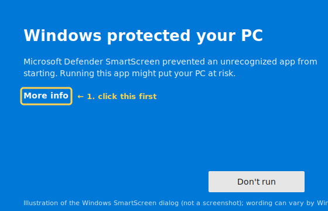
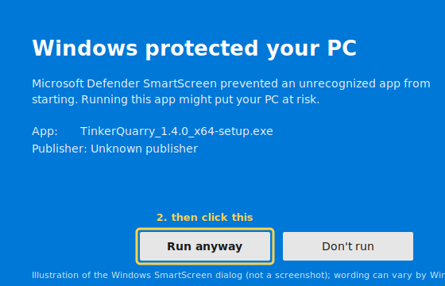
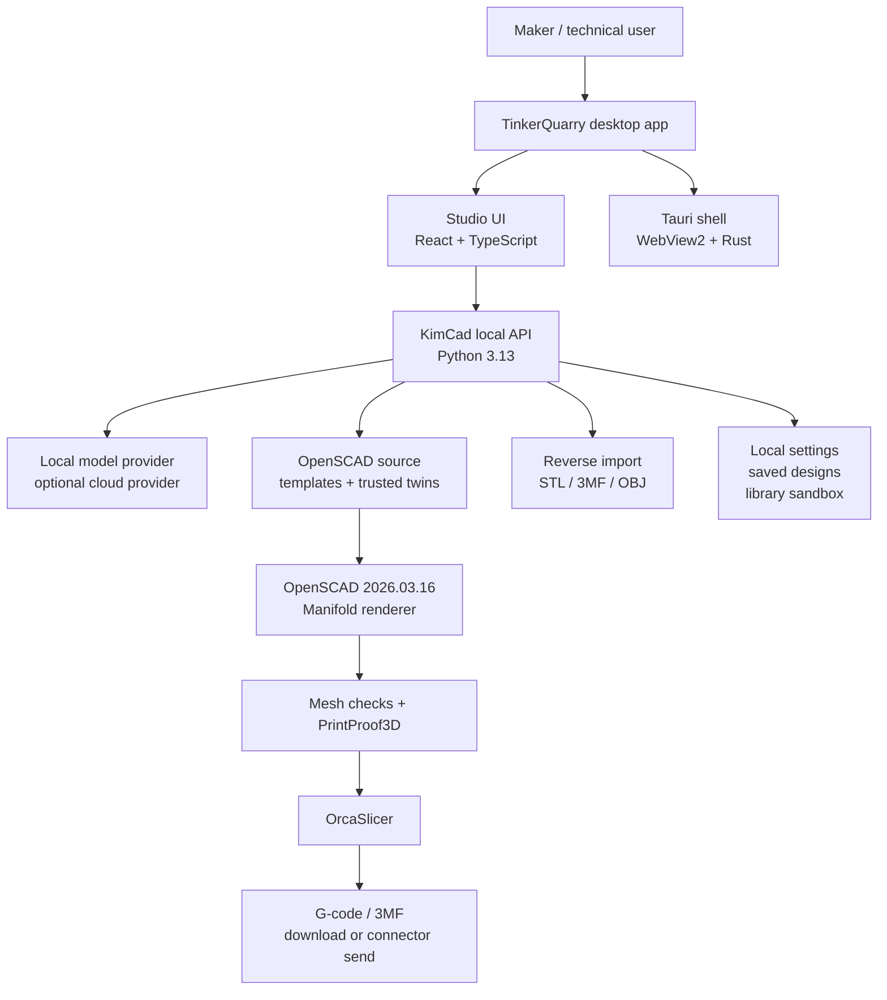
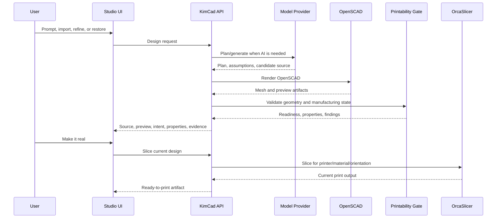
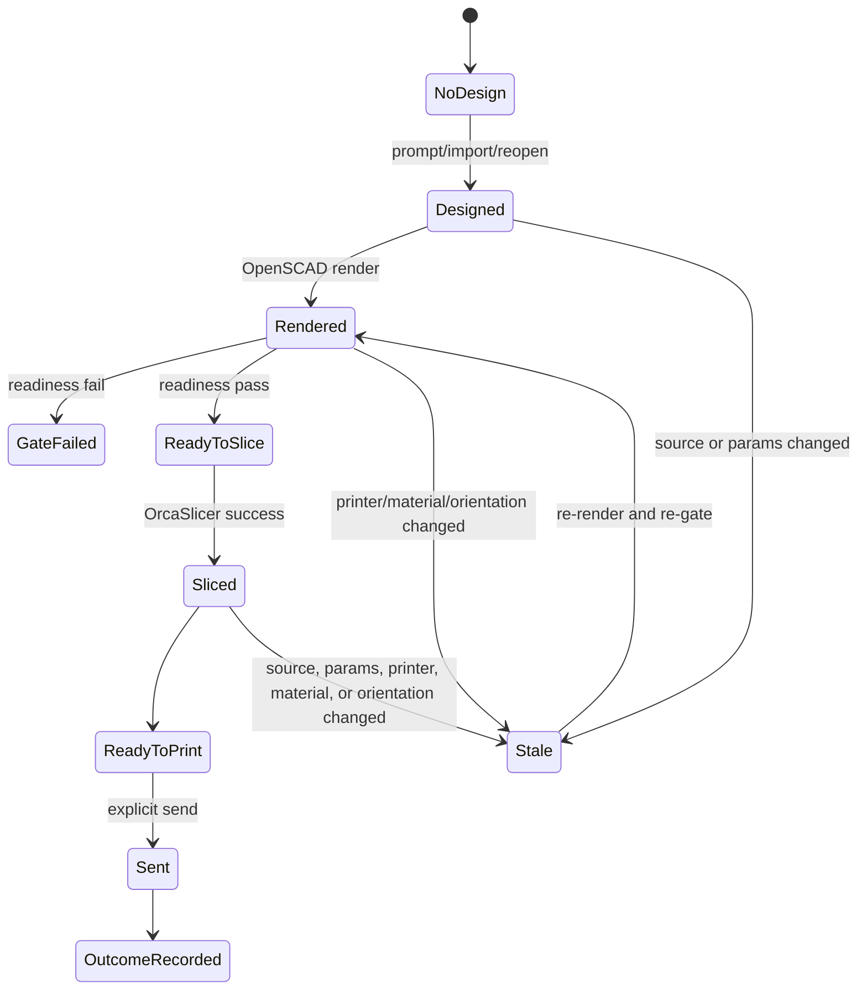
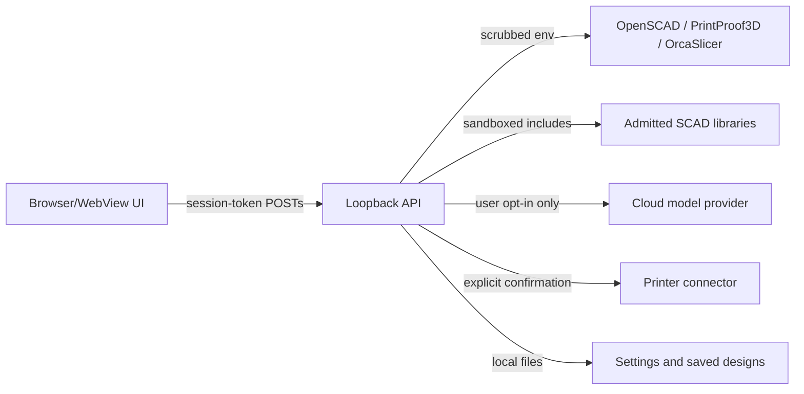

# TinkerQuarry User Manual

**Product:** TinkerQuarry v1.4.0 Windows beta
**Engine:** KimCad 0.9.4
**Last updated:** 2026-07-09
**License:** GPL-2.0-only

This manual has three sections:

1. [Non-Technical User](#non-technical-user)
2. [Technical User](#technical-user)
3. [Architecture](#architecture)

---

# Non-Technical User

## What TinkerQuarry Is

TinkerQuarry helps you make practical 3D-printable parts from plain language. Instead of opening CAD
and drawing from scratch, you describe what you need:

```text
a wall hook for a 12 mm dowel, with two screw holes
```

TinkerQuarry turns that request into editable OpenSCAD, renders a 3D model, checks whether it fits
the selected printer/material, estimates useful physical properties, slices the part, and prepares a
download or printer handoff.

TinkerQuarry is strongest for functional parts:

- clips, brackets, mounts, hooks, trays, holders, spacers, standoffs, simple enclosures, jigs;
- parts with clear dimensions and a clear job;
- quick iteration where you want to try a design, refine it, and save the best version.

TinkerQuarry is not a certified engineering tool. For safety-critical parts, formal tolerances,
load-bearing guarantees, regulated products, or production manufacturing, use professional review
and appropriate CAD/engineering validation.

## Privacy

TinkerQuarry is local-first.

By default:

- no account is required;
- no telemetry is sent;
- prompts and designs stay on your computer;
- the local KimCad engine runs on your computer;
- all the bundled tools run locally too — OpenSCAD (the 3D geometry engine), OrcaSlicer (which
  prepares files for your printer), PrintProof3D (the printability checker), and the
  imported-file checks;
- cloud models are off.

If you enable cloud acceleration in Settings, your prompt can be sent to the provider you configure.
That is an opt-in setting. The app should be read as private by default, not cloud by default.

## Installing On Windows

1. Download `TinkerQuarry_1.4.0_x64-setup.exe` from the
   [v1.4.0 GitHub Release](https://github.com/scottconverse/TinkerQuarry/releases/tag/v1.4.0).
2. Double-click the installer.
3. If SmartScreen appears, follow the steps in the next section.
4. Launch **TinkerQuarry**.
5. Choose your default printer and material.
6. Start with a simple part.

### The SmartScreen Prompt, Step By Step

The beta installer is not yet code-signed, so Windows SmartScreen will usually show
**"Windows protected your PC"** the first time you run it. That warning means "this publisher is
not yet known to Microsoft," not "this file is unsafe." To continue:

1. On the blue SmartScreen dialog, click **More info**.

   

2. Click the **Run anyway** button that appears.

   

3. If your browser also flagged the download, choose **Keep** on the download bar first
   (Edge: `...` menu on the download, then **Keep**, then **Keep anyway**).

Only do this for installers you downloaded yourself from the official
[GitHub Releases page](https://github.com/scottconverse/TinkerQuarry/releases). When provenance
matters, verify the checksum before installing:

```powershell
Get-FileHash .\TinkerQuarry_1.4.0_x64-setup.exe -Algorithm SHA256
```

Compare the output against `SHA256SUMS.txt` on the release page. A match proves the file is
byte-for-byte the published artifact.

The unsigned state is expected for this beta line and is documented in the release status rather
than hidden. Code signing through SignPath Foundation is in progress for a future release.

## Your First Part

Good first prompt:

```text
a 70 mm round coaster, 4 mm tall, with a shallow raised rim
```

Good prompts usually include:

- the object type;
- one or more real dimensions;
- the job the part must do;
- important features such as holes, clips, slots, lips, rims, or mounting points;
- material or printer constraints if they matter.

Weak prompt:

```text
make a thing for my shelf
```

Better prompt:

```text
a shelf bracket, 90 mm tall, 60 mm deep, with two 4 mm wall screw holes
```

## The Main Workspace

After TinkerQuarry builds a part, you will see the Studio workspace.

Core areas:

- **3D viewer:** rotate, zoom, and inspect the generated model.
- **OpenSCAD source:** read or edit the generated source.
- **Customizer:** adjust exposed dimensions and parameters.
- **Intent panel:** see the parsed plan, assumptions, dimensions, and feature list.
- **Properties panel:** see estimated volume, material, mass, center of mass, surface area, bed
  contact, and bounding box.
- **Visual evidence cards:** compare labeled views when visual correction or inspection evidence is
  available.
- **Make it real rail:** choose printer/material, orient, validate, slice, download, send, and record
  outcome.
- **Provenance/toolbox disclosure:** see which tools or agents contributed to the design and what
  evidence they produced.

## Intent Panel

The Intent panel answers: "What did the app think I asked for?"

Use it to check:

- design summary;
- interpreted object type;
- important dimensions;
- assumptions the app made;
- requested features;
- features found or missing after generation;
- whether the result should be refined before printing.

If the Intent panel does not match your actual intent, refine before slicing.

## Properties Panel

The Properties panel helps you understand the physical part before printing.

It can show:

- bounding box;
- estimated volume;
- surface area;
- material estimate;
- mass estimate;
- center of mass;
- build-plate contact;
- orientation-sensitive manufacturing notes.

These are practical estimates, not certified metrology. Use them to catch obvious mistakes, compare
iterations, and decide whether a design is worth slicing.

## Visual Inspection Cards

Visual correction evidence is shown as labeled inspection cards. The goal is to make the app's
reasoning visible rather than magical.

Cards can show:

- front, side, top, and isometric views;
- before/after correction evidence;
- structural visual diff information;
- labeled observations from the advisory visual loop;
- whether a finding is pass, warning, or needs review.

Treat the visual loop as a second set of eyes. It is not measurement-grade inspection and does not
replace the manufacturing gate.

## Make It Real

The Make it real path is the manufacturing workflow.

The app separates three states:

- **Designed:** source exists and a model can be shown.
- **Ready to slice:** the current model passed readiness checks for the selected settings.
- **Ready to print:** the current model has a successful current slice.

Changing source, parameters, printer, material, or orientation can make an old slice stale. When that
happens, TinkerQuarry blocks send/download actions that would use the stale output.

## Slicing, Downloading, And Sending

When the model passes readiness:

1. Choose or confirm printer and material.
2. Adjust orientation if needed.
3. Slice.
4. Download the resulting print file or send through a configured connector.
5. Record the outcome if you actually printed it.

The mock connector is verified by automated tests. Real hardware connectors require your own printer
configuration and careful first-use confirmation.

## Saving And Reopening Designs

You can save, reopen, rename, duplicate, delete, restore, and branch designs. A saved design is not a
permanent manufacturing guarantee. When you reopen or restore a design, re-render and re-gate before
printing.

Export options include:

- `.kimcad` portable project;
- `.scad`;
- STL, OBJ, AMF, 3MF;
- SVG, DXF;
- PNG preview;
- STEP when a trusted CadQuery twin is available.

## Reverse Import

Reverse import accepts STL, 3MF, or OBJ files and tries to recover an editable trusted template when
the uploaded mesh clearly matches a known part family.

It is intentionally conservative:

- unreadable meshes are rejected;
- unknown part families are rejected;
- known families are rebuilt and compared by bounding box, volume, and surface area;
- rejected imports do not become editable designs.

That means a malformed mesh test succeeds when the app rejects the bad file. Rejection is the
intended behavior for unsafe or unrecognized reverse imports.

STEP/STP reverse import is not supported yet. STEP is currently an export lane for trusted template
twins.

## Troubleshooting

| Problem | Likely cause | What to do |
| --- | --- | --- |
| Build button disabled | Engine or model unavailable | Follow the on-screen recovery text, then click Check again |
| Design is wrong | Prompt was ambiguous | Add exact dimensions and describe missing features |
| Slice is blocked | Gate failed or source is stale | Read the named finding, re-render, then slice again |
| Send is disabled | No current successful slice | Slice the current design first |
| Imported mesh rejected | Bad mesh or unknown family | Use a known exported family or keep it as a mesh-only reference |
| SmartScreen warning | Unsigned beta installer | Verify GitHub Release provenance before continuing |

---

# Technical User

## Version Surfaces

| Surface | Version | Notes |
| --- | ---: | --- |
| Product release | v1.4.0 | Desktop product, README, docs, installer filename |
| `apps/ui` | 1.4.0 | React/Tauri Studio package |
| Tauri config | 1.4.0 | Native Windows app metadata |
| Tauri Rust package | 1.4.0 | Native shell crate metadata |
| KimCad engine | 0.9.4 | Internal Python engine and `/api/health` version |
| `apps/web` | 0.6.0 | Optional share web surface |
| `packages/shared` | 0.4.0 | Shared TypeScript helpers |
| OpenSCAD | 2026.03.16 | Bundled Windows snapshot, Manifold default |
| PrintProof3D | 0.6.2 | Arm's-length printability tool |

These numbers are intentionally not collapsed into one version. The product line is v1.4.0; the
engine reports 0.9.4.

## Repository Layout

```text
apps/ui/           React/TypeScript Studio UI and Tauri desktop shell
apps/web/          Optional public/share web app
packages/engine/   KimCad engine, local HTTP API, tools, config, printer profiles
packages/shared/   Shared TypeScript helpers
docs/              Product docs, architecture, status, discussion seeds, audits
scripts/           Native release, smoke, and gate helper scripts
frontend/          Historical static prototype, not product evidence
```

## Source Setup

```powershell
cd path\to\TinkerQuarry
corepack enable
pnpm install
cd packages\engine
py -3.13 -m venv .venv
.\.venv\Scripts\python.exe -m pip install -r requirements.lock
.\.venv\Scripts\python.exe -m pip install -e .
.\.venv\Scripts\python.exe -m pip install -e ".[dev]"
```

Development servers:

```powershell
# Terminal 1
cd path\to\TinkerQuarry\packages\engine
$env:TINKERQUARRY_DEV_TOKEN = "tq-dev-token"
.\.venv\Scripts\kimcad.exe web --port 8765
```

```powershell
# Terminal 2
cd path\to\TinkerQuarry\apps\ui
pnpm dev
```

Open `http://localhost:1420`.

## Commands

```powershell
pnpm -r lint
pnpm -r type-check
pnpm test:unit
pnpm test:web:unit
pnpm test:e2e:web
pnpm test:rust
pnpm test:rust:audit
pnpm test:gate
pnpm test:release
```

Engine:

```powershell
cd packages\engine
.\.venv\Scripts\python.exe -m pytest tests -q
.\.venv\Scripts\kimcad.exe web --port 8765
.\.venv\Scripts\kimcad.exe design "a cable clip for an 8 mm cable" --slice
```

Native build:

```powershell
scripts\native-release.cmd
```

If NSIS fails from a deep path, copy the repo to a short path such as `C:\tqbuild\TinkerQuarry` and
run the native release command there. The current rerun passed from that short path.

## HTTP API Families

The Studio UI talks to the local KimCad API through `/api/*`.

Important endpoint families:

- `/api/health`
- `/api/model-status`
- `/api/model-pull`
- `/api/settings`
- `/api/options`
- `/api/templates`
- `/api/design`
- `/api/render/<rid>`
- `/api/reverse-import`
- `/api/mesh/<rid>`
- `/api/step/<rid>`
- `/api/slice/<rid>`
- `/api/send/<rid>`
- `/api/print-outcome/<rid>`
- `/api/designs`
- `/api/connectors`
- `/api/connections`

Full [API reference](https://github.com/scottconverse/TinkerQuarry/blob/main/packages/engine/docs/api.md)
(on GitHub — the file lives outside this site's publish root).

## Manufacturing State Rules

TinkerQuarry is deliberately strict:

- a design can render without being printable;
- a readiness pass can allow slicing without being ready to print;
- only a current successful slice makes a design ready to print;
- source edits, parameter changes, orientation changes, printer changes, and material changes
  invalidate stale output;
- send and outcome endpoints refuse unsafe state server-side.

## Reverse Import Contract

`POST /api/reverse-import` accepts raw STL, 3MF, or OBJ bytes plus
`X-TinkerQuarry-Filename`.

The importer:

1. loads and measures the mesh;
2. compares it to known part-family envelopes;
3. rebuilds the trusted family;
4. compares bounding box, volume, and surface area;
5. registers an editable design only when confidence is high enough.

Malformed files and unknown families are recoverable refusals, not crashes.

## CadQuery / STEP Lane

The editable CAD precision lane uses trusted CadQuery twins for template families. When available,
the engine exposes a lazy `step_url`. The STEP file is generated on first request and cached for that
design version. Re-rendering invalidates old STEP output.

This is separate from mesh reverse import. Today:

- STEP export: supported where a trusted twin exists and CadQuery is available.
- STEP reverse import: roadmap item.
- Mesh reverse import: implemented for known trusted families.

## Security And Privacy Controls

Controls in the current product:

- loopback-first local API;
- per-boot session token on state-changing requests;
- explicit dev token in local development;
- subprocess environment scrubbing;
- admitted SCAD library sandbox;
- path redaction in public API responses;
- no telemetry by default;
- optional cloud provider only after user configuration;
- secrets masked and never returned in full;
- cloud/provider keys stored through the OS credential store when available, with disclosed fallback.

## Release Evidence

Current-tree gate evidence:

- `pnpm test:gate`: passed.
- UI Jest: 94 suites / 670 tests in the final gate run.
- Web Jest: 4 suites / 20 tests in the final gate run.
- Engine pytest: 1755 passed, 0 skipped, in the final gate run.
- Playwright browser e2e: 7 passed in the final gate run.
- `scripts\native-release.cmd`: passed.
- `pnpm test:e2e:tauri`: passed against the release executable.
- `pnpm test:e2e:tauri:installed`: passed against the installed NSIS copy.

The **only** source of truth for the published installer's checksum is `SHA256SUMS.txt` on the
[v1.4.0 GitHub Release](https://github.com/scottconverse/TinkerQuarry/releases/tag/v1.4.0) —
compare your `Get-FileHash` output against that file (the release's `release-manifest.json`
pins the exact source commit the artifacts were built from). This manual deliberately does not
repeat the hash: a locally rebuilt installer produces a different, equally valid hash, and a
stale copy here would read like a tampered download.

---

# Architecture

## System Context



## Product Data Flow



## Manufacturing State Machine



## Trust Boundaries



Key principle: the app may be AI-assisted, but manufacturing state is deterministic and fail-closed.
The UI can offer suggestions; the engine enforces state.

## Component Responsibilities

| Component | Responsibility |
| --- | --- |
| Tauri shell | Native window, packaged app identity, sidecar/runtime launch, Windows installer |
| Studio UI | Prompting, editor, viewer, panels, workflow controls, accessibility states |
| KimCad API | Local state orchestration, settings, validation, tool execution, security checks |
| Template registry | Known parametric part families and trusted geometry contracts |
| Reverse importer | Conservative mesh-to-known-family recovery |
| OpenSCAD | Source-to-mesh rendering |
| PrintProof3D / mesh checks | Readiness and printability evidence |
| OrcaSlicer | Printer/material-specific slicing |
| CadQuery twins | STEP export and editable CAD precision lane for supported families |
| Share web app | Optional public/share surface, separate from private desktop workflow |

## Roadmap Boundaries

Implemented:

- intent/properties/evidence/provenance panels;
- mesh reverse import for known trusted families;
- STEP export from trusted CadQuery twins;
- local-first design, validation, slicing, and installer smoke.

Roadmap:

- broader known-family reverse import;
- STEP/STP reverse-to-parametric import;
- expanded printer hardware certification;
- signed Windows installer;
- additional platform packages after Windows beta stabilizes.
