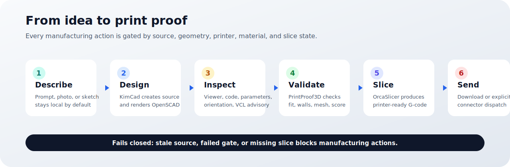
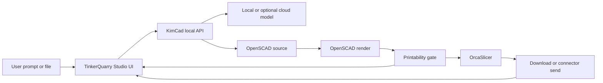
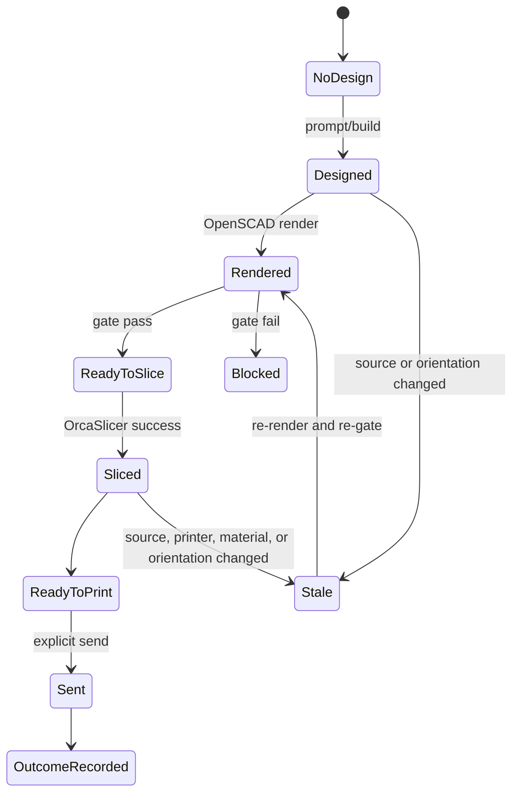

# TinkerQuarry User Manual

**Release:** v1.3.1 beta
**Audience:** makers, beta testers, technical users, contributors, and support teams
**Last updated:** 2026-06-23

TinkerQuarry is a local-first desktop application for creating real 3D-printable parts from plain
language. You describe the part, review the generated model, validate it against printer/material
constraints, slice it, and download or send the proven output.



## How To Read This Manual

- **Part 1: Everyday Use** is for non-technical users. It explains the product, the workflow, and
  common troubleshooting without assuming CAD or software development knowledge.
- **Part 2: Technical Reference** is for developers, power users, and support staff. It covers the
  local engine, commands, files, APIs, tests, and release proof.
- **Part 3: Architecture And Technologies** explains how the product is built and where each
  technology fits.

## Product Truth For v1.3.1

TinkerQuarry v1.3.1 is a Windows beta whose core path is implemented and release-tested:

- describe -> design -> preview -> validate -> slice -> mock send/outcome;
- native Windows build and installed-app smoke;
- local-first operation with optional cloud model configuration;
- advisory Visual Correction Loop, not metrology-grade vision;
- no hardware-printer certification yet beyond the connector implementation and mock-send proof.

The current evidence-backed status matrix is [STATUS.md](STATUS.md).

---

# Part 1: Everyday Use

## 1. What TinkerQuarry Is

TinkerQuarry helps you make functional 3D-printed parts without starting in CAD. You can type:

```text
a wall hook for a 12 mm dowel, with two screw holes
```

The app turns that request into OpenSCAD source, renders a model, checks that it can be printed, and
produces a slicer-ready file.

TinkerQuarry is best for:

- brackets, hooks, mounts, clips, trays, holders, and organizer parts;
- parts with clear real-world dimensions;
- fast iteration where you want to refine a generated design;
- local/private work where prompts and files should stay on your machine.

TinkerQuarry is not a replacement for expert CAD when you need fully controlled engineering drawings,
metrology-grade inspection, assemblies with formal tolerances, or certified safety-critical parts.

## 2. Privacy And Local-First Behavior

By default:

- no account is required;
- prompts, images, and designs stay on your computer;
- the engine runs locally;
- OpenSCAD, PrintProof3D, and OrcaSlicer run as local tools;
- cloud AI is off unless you configure a provider and API key.

If you enable a cloud model in Settings, text prompts may be sent to that provider. Vision review
remains a local/advisory workflow in the beta model.

## 3. Install And First Launch

The supported beta target is Windows.

1. Install `TinkerQuarry_1.3.1_x64-setup.exe` from the
   [v1.3.1 release](https://github.com/scottconverse/TinkerQuarry/releases/tag/v1.3.1).
2. Launch **TinkerQuarry**.
3. Confirm printer and material choices.
4. Choose or configure a local AI provider if prompted.
5. Start with a simple functional part.

For source builds, see [Part 2](#part-2-technical-reference).

### First-Run States You May See

| State                | What It Means                                        | What To Do                                             |
| -------------------- | ---------------------------------------------------- | ------------------------------------------------------ |
| Engine unavailable   | The local KimCad engine is not reachable             | Restart the app or run the engine manually in dev mode |
| AI missing           | No local model is detected                           | Use Settings to configure or fetch a local model       |
| Tool missing         | OpenSCAD, OrcaSlicer, or PrintProof3D is unavailable | Use the bundled installer path or check tool settings  |
| Printer not selected | The app cannot validate against a build volume       | Choose a printer and material                          |

## 4. The Main Workflow

### Step 1: Describe The Part

Use the prompt box on the first screen. Good prompts include:

- the object type;
- at least one important dimension;
- the job the part must do;
- any holes, clips, slots, or mounting needs.

Examples:

```text
a 70 mm round drink coaster, 4 mm tall, with a shallow rim
a cable clip for an 8 mm cable with one screw hole
a small bracket with two 4 mm mounting holes, 40 mm apart
```

### Step 2: Review The Design

After generation, TinkerQuarry opens the workspace:

- **Studio viewer**: inspect the 3D result.
- **Code editor**: inspect or edit generated OpenSCAD.
- **Customizer**: adjust exposed parameters.
- **Customize / Make it real rail**: track readiness, orientation, slice, send, and iteration log.

### Step 3: Tune Or Refine

Prefer parameter controls when available. They are deterministic and re-render without asking the AI
to redesign the part. Use natural-language refinement for shape changes, missing features, or design
intent changes.

Manual source edits are allowed, but TinkerQuarry treats edited source as stale until it is re-rendered
and re-validated.

### Step 4: Validate Readiness

The printability gate checks whether the model is ready for manufacturing. It considers:

- mesh solidity;
- dimensions;
- build-volume fit;
- wall and feature constraints;
- printer/material profile;
- stale source or stale slice state.

The product only says **Ready to print** after a successful slice, not merely after a design gate pass.

### Step 5: Orient And Slice

Use orientation controls if the part needs a different build-plate pose. Orientation changes invalidate
the old slice, which prevents accidental sends from stale G-code.

Click **Make it real** or **Slice** when readiness is acceptable. TinkerQuarry invokes OrcaSlicer and
produces G-code output.

### Step 6: Download Or Send

You can download the output or send it through a configured connector. The built-in mock connector is
used for release proof. Real hardware connectors require printer-specific configuration and explicit
confirmation.

## 5. Visual Correction Loop

The Visual Correction Loop is an advisory local review path. It captures rendered views and asks a
local vision-capable model decomposed yes/no questions about visible features.

In v1.3.1:

- the loop can flag likely visual issues;
- empty, unparseable, or conflicting model answers become **needs review**, not pass;
- the app can perform bounded correction rounds and preserve prior candidates;
- the loop is not a substitute for deterministic geometry checks, slicing, or human inspection.

Use it as a second set of eyes, not as a manufacturing certification.

## 6. Saving, Restoring, And Exporting

TinkerQuarry keeps a session iteration log and supports saved designs. Common actions:

- save a design;
- reopen it from My Designs;
- rename or duplicate it;
- export a portable `.kimcad` file;
- export `.scad`, STL, OBJ, AMF, 3MF, SVG, DXF, PNG preview, and STEP when available;
- restore prior iteration snapshots.

Restored snapshots are source snapshots. Re-render and re-validate before manufacturing from them.

## 7. Settings

Key settings areas:

- **AI/model provider**: choose local or optional cloud provider.
- **Printer/material**: choose default manufacturing target.
- **Libraries**: admit user-installed SCAD libraries into a sandbox.
- **About/licenses**: review version, source, and third-party notices.

External libraries are copied into an admitted sandbox and referenced by an `external/<slug>/` include
prefix. Local source paths are redacted from public API responses.

## 8. Troubleshooting For Non-Technical Users

| Problem                     | Likely Cause                                  | What To Try                                                         |
| --------------------------- | --------------------------------------------- | ------------------------------------------------------------------- |
| Build button is disabled    | Engine or AI provider unavailable             | Open Settings, confirm engine/model status, then click Check again  |
| Design takes a long time    | Local model is cold-loading                   | Wait for the first run; later runs are usually faster               |
| Part will not slice         | Readiness gate failed or source is stale      | Read the named checks, adjust the part, re-render, then slice again |
| Send is disabled            | No successful current slice                   | Slice the current design first                                      |
| Dimensions are wrong        | Prompt was ambiguous or edit was not re-gated | Add exact dimensions, re-render, then re-check                      |
| Cloud option is unavailable | No provider/key configured                    | Add provider settings only if you want cloud use                    |

---

# Part 2: Technical Reference

## 9. Repository Layout

```text
apps/ui/          React/TypeScript Studio UI and Tauri desktop shell
apps/web/         public/share web surface
packages/engine/  KimCad Python engine, local HTTP API, tools, printer profiles
packages/shared/  shared helper package
docs/             manual, architecture, status, audits, landing page
scripts/          native release and smoke-test helpers
```

## 10. Versions

| Surface           |    Version | Meaning                                    |
| ----------------- | ---------: | ------------------------------------------ |
| Product release   |     v1.3.1 | GitHub tag and desktop app release         |
| `apps/ui`         |      1.3.1 | TinkerQuarry Studio/Tauri package          |
| KimCad engine     |      0.9.3 | Internal engine and CLI version            |
| `apps/web`        |      0.6.0 | Share/web package                          |
| `packages/shared` |      0.4.0 | Shared helper package                      |
| OpenSCAD          | 2026.03.16 | Bundled Windows snapshot, Manifold default |
| PrintProof3D      |      0.6.2 | Arm's-length validation binary             |

These are intentionally not all the same number because they describe different packages.

## 11. Development Setup

Fresh source setup:

```powershell
cd C:\Users\Scott\Desktop\CODE\tinkerquarry
corepack enable
pnpm install
cd packages\engine
py -3.13 -m venv .venv
.\.venv\Scripts\python.exe -m pip install -r requirements.lock
```

Then use two PowerShell terminals:

```powershell
cd C:\Users\Scott\Desktop\CODE\tinkerquarry\packages\engine
$env:TINKERQUARRY_DEV_TOKEN = "tq-dev-token"
.\.venv\Scripts\kimcad.exe web --port 8765
```

```powershell
cd C:\Users\Scott\Desktop\CODE\tinkerquarry\apps\ui
pnpm dev
```

Open `http://localhost:1420`.

## 12. Common Commands

```powershell
pnpm -r lint
pnpm -r type-check
pnpm test:unit
pnpm test:web:unit
pnpm test:e2e:web
pnpm test:release
```

Engine tests:

```powershell
cd C:\Users\Scott\Desktop\CODE\tinkerquarry\packages\engine
.\.venv\Scripts\python.exe -m pytest tests -q
```

Native build:

```powershell
cd C:\Users\Scott\Desktop\CODE\tinkerquarry
pnpm --dir apps\ui tauri build
```

## 13. CLI And API

KimCad is the internal engine command:

```powershell
kimcad web --port 8765
kimcad web --port 8765 --demo
kimcad design "a cable clip for an 8 mm cable" --slice
```

The UI talks to the local engine through `/api/*`, proxied in development and served by the local
engine in packaged flows.

Important endpoint families:

- `/api/health`
- `/api/model-status`
- `/api/design`
- `/api/render`
- `/api/slice`
- `/api/send`
- `/api/print-outcome`
- `/api/options`
- `/api/connectors`

Manufacturing endpoints require the current design state, readiness state, slice state, and explicit
confirmation where appropriate.

## 14. Security Model

TinkerQuarry's release posture is local-first and fail-closed:

- loopback-first local HTTP API;
- per-boot session token;
- subprocess environment scrubbing for external tools;
- admitted SCAD library sandbox;
- public API path redaction;
- no telemetry by default;
- optional cloud provider use requires user configuration.

OpenSCAD, PrintProof3D, and OrcaSlicer are run as arm's-length subprocess tools. This keeps their
licensing and execution boundary explicit.

The optional share web surface is deployed separately on Cloudflare Pages. It requires `SHARE_KV`,
`SHARE_R2`, and a `SHARE_RATE_LIMITER` Durable Object worker named
`tinkerquarry-share-rate-limiter`. Maintainers deploy the Durable Object first with
`pnpm --filter web share:rate-limiter:deploy`, then deploy Pages; `pnpm test:web:share-deploy`
verifies the build, Pages Functions compile, and Durable Object dry-run path.

## 15. Release Gate

The release command is:

```powershell
pnpm test:release
```

For v1.3.1, it passed on commit `4e159c2a189e4b388204baf636acd46ac430a1c0`
before the public tag and release assets were published. It includes:

- lint;
- type-check;
- UI unit tests;
- web unit tests;
- engine pytest suite;
- Playwright browser e2e;
- Rust/Tauri tests;
- native Windows package build;
- release executable smoke;
- installed NSIS workflow smoke.

Release assets, manifest, and checksums:
[github.com/scottconverse/TinkerQuarry/releases/tag/v1.3.1](https://github.com/scottconverse/TinkerQuarry/releases/tag/v1.3.1).

---

# Part 3: Architecture And Technologies


## 16. Component Summary

| Layer         | Technology                                        | Responsibility                                       |
| ------------- | ------------------------------------------------- | ---------------------------------------------------- |
| Desktop shell | Tauri 2, WebView2                                 | Native Windows app, engine startup, packaging        |
| UI            | React, TypeScript, Monaco, Three.js               | Workspace, editor, viewer, controls, dialogs         |
| Engine        | Python 3.13                                       | Design pipeline, local API, validation orchestration |
| Geometry      | OpenSCAD 2026.03.16                               | SCAD rendering, Manifold backend by default          |
| Validation    | PrintProof3D 0.6.2, mesh checks                   | Readiness report and printability findings           |
| Slicing       | OrcaSlicer                                        | Printer-ready G-code generation                      |
| Models        | local OpenAI-compatible providers, optional cloud | design planning and advisory visual review           |
| Storage       | local filesystem                                  | settings, saved designs, admitted libraries, exports |

## 17. Data Flow



## 18. Manufacturing State Machine



## 19. Naming

- **TinkerQuarry** is the product, UI, installer, public documentation, and GitHub repository.
- **KimCad** is the internal engine and CLI.
- **OpenSCAD Studio** is the upstream UI base that was absorbed into `apps/ui`; it is credited in
  About/Licenses but is not the product name.

## 20. Licensing

TinkerQuarry is GPL-2.0-only. Third-party components are documented in
[THIRD_PARTY_LICENSES.md](../packages/engine/THIRD_PARTY_LICENSES.md).

The bundled SCAD library set is intentionally limited to GPL-2.0-compatible libraries. The project
does not vendor Dan Kirshner `threads.scad` because the available source is GPL-3.0-or-later.
